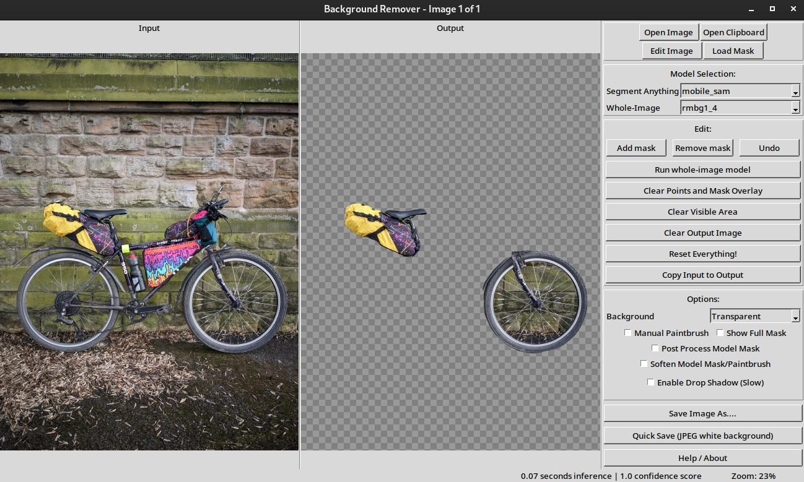

# Interactive Image Background Remover

Interactive Background Remover is a user-friendly tool designed to remove backgrounds from images using a combination of interactive models (Segment Anything) and automatic whole-image models (such as u2net, disnet, rmbg, and BiRefNet). This allows you to refine and fine tune your background removal, in a similar way to apps like Photoroom, instead of only running models on the entire image.



## Features

- **Interactive Model Support**: Utilise Segment Anything for detailed object selection by clicking or drawing boxes on the image.
- **Automatic Whole-Image Model Support**: Apply models like u2net, disnet, rmbg, and BiRefNet for quick background removal across the entire image, which can be further refined.
- **Zoom and Pan**: Zoom in on specific parts of the image and pan around for detailed editing. The models are only run on the viewed area so you can incrementally build up an image from higher resolution patches.
- **Manual Paintbrush Mode**: Manually refine the background removal with a paintbrush tool for areas not covered by the models.
- **Mask Refinement**: Smooth edges, filter anomalous areas and soften the mask for a natural look. You can directly edit the mask for high fidelity background removal.
- **Drop Shadow**: Basic drop shadow effect for the cutout object.
- **Background Options**: Choose from various background colors or apply a blurred background effect.
- **Image Editing**: Includes a built-in image editor and cropper to preprocess images before background removal.
- **Undo/Redo**
- **Save Options**: Save the processed image in various formats (PNG, JPEG, WebP) with customisable quality settings and auto-trim.
- **Clipboard Support**: Load images directly from the clipboard for quick editing.
- **Windows, Linux and Mac Builds**: In the Github releases. Mac is currently untested, please let me know


## Installation

### Prerequisites

- Python 3.x
- Required Python packages: `Pillow`, `numpy`, `onnxruntime`, `opencv-python`, `PyQt6`, `requests`, `pymatting`


```bash
pip install pyqt6 Pillow numpy onnxruntime opencv-python requests pymatting
```

Or download prebuilt executables for Windows, Linux and Mac from the [Github releases](https://github.com/pricklygorse/Interactive-Image-Background-Remover/releases) 

### GPU Support

When running from the script, you will need to install the appropriate onnxruntime package for your hardware. Only install one of these packages, and remove any onnxruntime packages before installing a new one. [Executable releases](https://github.com/pricklygorse/Interactive-Image-Background-Remover/releases) are built with the appropriate runtime.

```bash
pip install onnxruntime # CPU only
pip install onnxruntime-gpu # Nvidia CUDA, TensorRT
pip install onnxruntime-openvino # Intel iGPU and GPU
pip install onnxruntime-directml # Microsoft Windows general machine learning (Nvidia, AMD, Intel)
```


## Model Downloads

This application requires pre-trained background removal/segmentation models in onnx format to function correctly. Please download the necessary models and place them in the Models/ directory. The script checks for models at each start up. 

**Interactive Models**
- Segment Anything + mobile-sam: [https://huggingface.co/vietanhdev/segment-anything-onnx-models/tree/main](https://huggingface.co/vietanhdev/segment-anything-onnx-models/tree/main)

   In the mobile_sam download, rename sam_vit_h_4b8939.decoder.onnx to mobile_sam.decoder.onnx, so there is a matching .encoder and .decoder. 

I recommend just using mobile-sam as it has near instant inference results, and you can zoom into the image for higher resolution masks. I haven't found much benefit to using the larger models.

If using quantised Segment Anything models, these require the .quant suffix before .encoder in the filename, which is the opposite of how they are named when downloaded from the links above.

**Whole Image Models**
- rembg: [https://huggingface.co/briaai/RMBG-1.4/tree/main/onnx](https://huggingface.co/briaai/RMBG-1.4/tree/main/onnx)

   - Please rename model.onnx to rmbg1_4.onnx

- u2net, disnet, BiRefNet, Segment Anything, and more: [https://github.com/danielgatis/rembg/releases/tag/v0.0.0](https://github.com/danielgatis/rembg/releases/tag/v0.0.0)
- rmbg2: [https://huggingface.co/briaai/RMBG-2.0/tree/main/onnx](https://huggingface.co/briaai/RMBG-2.0/tree/main/onnx)
   - Please rename model.onnx to rmbg2.onnx, or the quantised versions to rmbg2_q4.onnx etc

```python
# partial string match so will also match quantised versions e.g. rmbg2_quant_q4
sam_models = [
            "mobile_sam",
            "sam_vit_b_01ec64", 
            "sam_vit_h_4b8939",
            "sam_vit_l_0b3195",
            ]

whole_models = [
        "rmbg1_4",
        "rmbg2",
        "isnet-general-use",
        "isnet-anime",
        "u2net",
        "u2net_human_seg",
        "BiRefNet", # matches all birefnet variations
]
```

## Usage

### Launching the Application

Run the rebuilt executables: [Github releases](https://github.com/pricklygorse/Interactive-Image-Background-Remover/releases) 

Run the script from the command line:

```bash
python interactive_background_remover.py
```

You can also provide image file paths as command-line arguments to load them directly:

```bash
python interactive_background_remover.py image1.jpg image2.png
```


### Interface Overview

- **Input Canvas**: Displays the original image.
- **Output Canvas**: Displays the processed image with the background removed.
- **Controls Panel**: Contains various tools and options for interacting with the image and models.

### Basic Workflow

1. **Load Image**: Click "Open Image" to load an image file or "Open Clipboard" to use an image from the clipboard.
2. **Select Model**: Choose a model from the "Model Selection" section.
3. **Zoom and Pan**: Use the full image or zoom into region of interest (arrow keys or middle mouse to pan, mouse scroll to zoom)
4. **Generate Background Removal Mask**:
   - **Interactively: Segment Anything**: Left-click to add a positive point, right-click to add a negative (exclusion) point, or drag to draw a box around the object.
   - **Automatic: Whole-Image Models**: Click "Run whole-image model" to apply the selected model to the entire image (or zoomed area).
5. **Refine Background Removal Mask**:
   - Use the "Add mask" and "Subtract mask" buttons to add the model output to the background removal mask.
   - Toggle "Manual Paintbrush" mode to manually edit the mask. Right click to draw a mask, left to erase.
   - Check "Post Process Model Mask" (binarise the mask and smooth edges) and "Soften Model Mask/Paintbrush" to adjust the model output
   - Use Show Full Mask to edit the mask directly instead of the output image
6. **Adjust Background**: Select a background color or enable the "Blurred" option for a blurred background.
7. **Save Image**: Click "Save Image As...." to save the processed image.


### Hotkeys

- `a`: Add current mask to the output image.
- `s`: Subtract current mask from the output image.
- `Ctrl+z`: Undo the last action.
- `p`: Toggle manual paintbrush mode.
- `c`: Clear current mask and coordinate points.
- `w`: Reset the current working image.
- `r`: Reset everything (image, masks, coordinates).
- `v`: Clear the visible area on the working image.
- `Ctrl+s`: Save as....
- `Ctrl+Shift+S`: Quick save JPEG with a white background.
- `u`: Run u2net model.
- `i`: Run disnet model.
- `o`: Run rmbg1.4 model.
- `b`: Run BiRefNet model.
- `Middle Mouse`, `Left`, `Right`, `Up`, `Down`: Pan the image.
- `Ctrl + trackpad`: Zoom


### Image Editing

Click "Edit Image" to open the built-in image editor, where you can crop, rotate, and adjust various image parameters like brightness, contrast, saturation, and white balance.


## Troubleshooting

- **No models found**: Ensure that the required models are downloaded and placed in the `Models/` directory.
- **Performance issues**: Zooming out can be laggy, especially with multiple scroll wheel clicks and multiple effects applied such as blurred background and drop shadow.

# Support Me

Find this useful and want to support my work? [You can buy me a coffee (or whatever) here.](https://ko-fi.com/pricklygorse) :)

I'm fairly new to python so any improvements to the code, features, and suggestions are welcome. There are likely bugs.


# Acknowledgements

This was originally inspired by the command line program [RemBG by Daniel Gatis](https://github.com/danielgatis/rembg), and some of the inference code is adapted from this. 

Huge thanks to Meta for Segment Anything and all the other model authors for releasing their models. 
