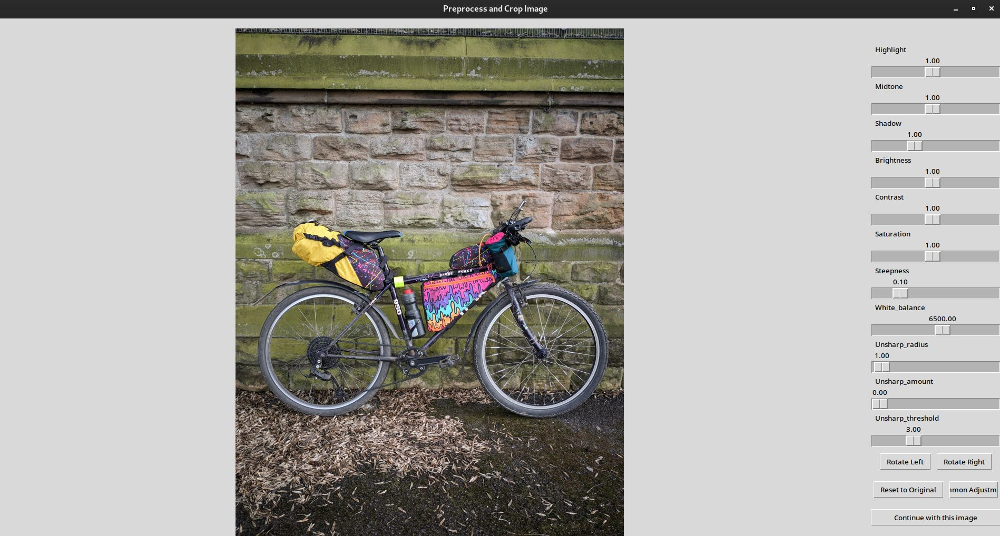

# Interactive Image Background Remover

A (work in progress) user interface for several background remover models, currently supporting onnx versions of u2net, disnet, rmbg, BiRefNet and Segment Anything (not V2 yet).


Load your image, and either run one of the whole image models (u2net, disnet, rmbg, BiRefNet) or click/draw a box to run Segment Anything. Left click is a positive point, right is a negative (avoid this area) point.

The original image is displayed on the left, the current image you are working on is displayed to the right.

Press A to add the current mask to your image, Z to remove.

Scroll wheel to zoom, and middle click to pan around the image. The models will be applied only to the visible zoomed image, which enables much higher detail and working in finer detail than just running the models on the whole image

Use manual paintbrush mode to draw areas that you want to add/remove to the image without using a model.

Post process mask removes the partial transparency from outputs of whole-image models. 

Includes a built-in image editor and cropper. Loading this will reset your current working image. 



Running the script from the command line with multiple images specified will load the images one after another for assisted batch usage.

# Usage

Usage:

Right Mouse click: Add coordinate point for segment anything models
Left Mouse click: Add negative coordinate (area for the model to avoid)
Right click and drag: Draw box for segment anything models

Hotkeys:

<a> Add current mask to working image
<z> Remove current mask from working image
<q> Undo last action
<p> Manual paintbrush mode
<c> Clear current mask (and coordinate points)
<w> Reset the current working image
<r> Reset everything (image, masks, coordinates)
<v> Clear the visible area on the working image
<s> Save as PNG
<j> Quick save JPG with white background

Whole image models (if downloaded to Models folder)
<u> u2net
<i> disnet
<o> rmbg
<b> BiRefNet-general-bb_swin_v1_tiny-epoch_232


# Models

Place the models (or symlinks if located elsewhere) in the Models folder. The model filenames are hardcoded currently sorry, so please rename your downloaded files to match what is listed below if needed. Quantised Segment Anything models require the .quant suffix before .encoder in the filename, which is the opposite of how they are downloaded from the links below.

I highly recommend starting with mobile-sam as it has almost instantaneous mask generation even on older cpu only computers, then trying the larger segment anything models if you need a higher quality mask. Zooming in and using mobile-sam however has been very effective for me.

Models can be downloaded from:

- Segment Anything + mobile-sam: [https://huggingface.co/vietanhdev/segment-anything-onnx-models/tree/main](https://huggingface.co/vietanhdev/segment-anything-onnx-models/tree/main)
- rembg: [https://huggingface.co/briaai/RMBG-1.4/tree/main/onnx](https://huggingface.co/briaai/RMBG-1.4/tree/main/onnx)
- u2net, disnet, BiRefNet, Segment Anything, and more: [https://github.com/danielgatis/rembg/releases/tag/v0.0.0](https://github.com/danielgatis/rembg/releases/tag/v0.0.0)

I've no idea what the different versions of BiRefNet are so the hardcoded 3 are not necessarily the best. 

```
BiRefNet-DIS-bb_pvt_v2_b0-epoch_590.onnx
BiRefNet-general-bb_swin_v1_tiny-epoch_232_FP16.onnx
BiRefNet-general-bb_swin_v1_tiny-epoch_232.onnx
isnet-general-use.onnx
mobile_sam.decoder.onnx
mobile_sam.encoder.onnx
rmbg1_4.onnx
rmbg1_4-quant.onnx
sam_vit_b_01ec64.decoder.onnx
sam_vit_b_01ec64.decoder.quant.onnx
sam_vit_b_01ec64.encoder.onnx
sam_vit_b_01ec64.encoder.quant.onnx
sam_vit_h_4b8939.decoder.quant.onnx
sam_vit_h_4b8939.encoder.quant.onnx
sam_vit_l_0b3195.decoder.quant.onnx
sam_vit_l_0b3195.encoder.quant.onnx
u2net.onnx
```


# Support Me

Find this useful and want to support my work? [You can buy me a coffee (or whatever) here.](https://ko-fi.com/pricklygorse) :)

I'm fairly new to python and tkinter so any improvements to the code, features, and suggestions are welcome. 


# Acknowledgements

This was originally inspired by the command line program [RemBG by Daniel Gatis](https://github.com/danielgatis/rembg), and some of the inference code is adapted from this. 

Huge thanks to Meta for Segment Anything and all the other model authors for releasing their models. 
